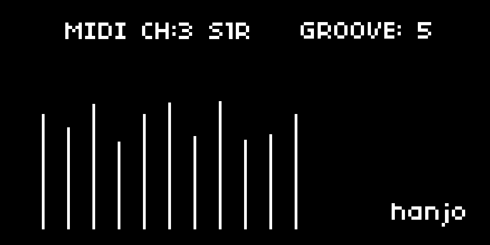
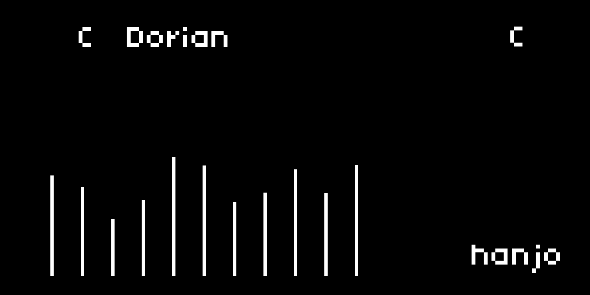

# **HiSwing**

**HiSwing** is a dynamic and customizable pattern and groove MIDI generator for Monome Norns.  
Create evolving percussions, hi-hats, and basslines with shifting velocity, pattern length, and density.

A tool for planting seeds of rhythm: patterns that rustle, shimmer, drift, and anchor.

**Author:** HANJO – Tokyo, Japan 🇯🇵

---
## **RELEASES**
Update v2.1 
- Includes a second page with a Cirklon inspired in scale note randomization that carries over the groove.
- Includes Tr-909 inspired Shuffle and Reversed Shuffle modes.

---

Note Mode:

---

## **FEATURES**

- Generates dynamic 16-step MIDI patterns
- Adjustable groove templates, step velocities, and reduction
- Randomization for evolving rhythms
- Full MIDI output (note C2 by default)

---

## **CONTROLS**

- **`K3 + E1`**: Toggle pages

- **`K2`**: Randomize step velocities  
- **`E2`**: Change pattern length  
- **`E3`**: Change groove template  
- **`K3 + E2`**: Change MIDI channel  
- **`K3 + E3`**: Adjust pattern reduction  
- **`K3 + K2`**: Shuffle Modes 
---

### **On Note Page**

- **`E1`**: Change root note  
- **`K3 + E2`**: Change scale  
- **`E2`**: Navigate and select steps  
- **`E3`**: Change note value  

---

## **VIDEO**

---

## **GROOVE TEMPLATES**

- **HOUSE 1**:  
  `127, 100, 127, 100, 127, 100, 127, 100, 127, 100, 127, 100, 127, 100, 127, 100`

- **FUNKY 1**:  
  `127, 64, 100, 64, 127, 64, 100, 64, 127, 64, 100, 64, 127, 64, 100, 64`

- **DEEP HOUSE**:  
  `127, 127, 89, 89, 127, 127, 89, 89, 127, 127, 89, 89, 127, 127, 89, 89`

- **GARAGE**:  
  `114, 114, 127, 89, 114, 114, 127, 89, 114, 114, 127, 89, 114, 114, 127, 89`

- **OLDSCHOOL**:  
  `127, 89, 114, 89, 127, 89, 114, 89, 127, 89, 114, 89, 127, 89, 114, 89`

- **ELECTRO BOUNCE**:  
  `127, 76, 127, 76, 127, 76, 127, 76, 127, 76, 127, 76, 127, 76, 127, 76`

---

## **OUTPUT**

- Sends MIDI note **C2** (Note 36) continuously
- MIDI Channel: default `1`, adjustable (1–16)

---

## **INSTALLATION**

1. Clone or download this repository into your `dust/code/` folder on your Norns.
2. Load the script from the `SELECT` screen.

---

## **USAGE TIPS**

- Use **`K2`** often to refresh patterns with random energy.
- Adjust **`E2`** to change the step count for shorter or longer loops.
- Explore different grooves with **`E3`** to radically change the vibe.
- Hold **`K3`** to switch to **MIDI Channel** and **Pattern Reduction** controls.

Patterns will evolve live without needing to stop playback.

---
## **SWING/ SHUFFLE MODES**

**Normal Swing:**
- **S1**: "Gentle Push"
- **S2**: "Pocket Groove" 
- **S3**: "Swing Step"
- **S4**: "Triplet Flow" 
- **S5**: "Heavy Shuffle" 

**Reverse Swing:**
- **S1R**: "Rushed Feel"
- **S2R**: "Anticipated" 
- **S3R**: "Pushed Beat" 
- **S4R**: "Racing Pulse" 
- **S5R**: "Rushed Shuffle" 

---

## **DEPENDENCIES**

- **musicutil** (built-in)
- **core/midi** (built-in)

---

## **LICENSE**

MIT License (see [LICENSE](./LICENSE))
